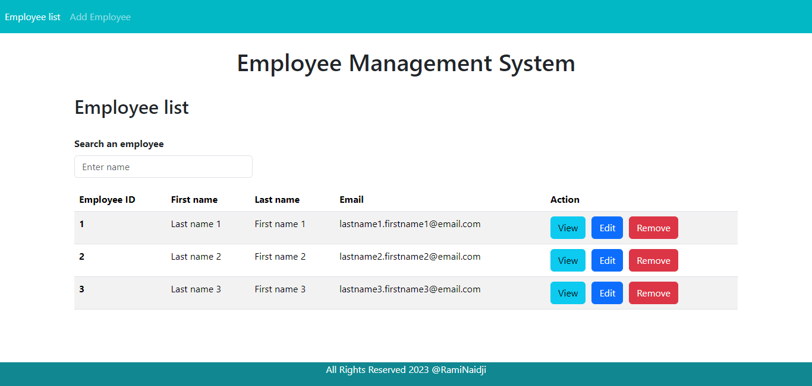

# Full-Stack Web Application with Java Spring Boot and Angular
This repository contains the source code for a full-stack web application built with Java Spring Boot for the backend and Angular for the frontend. The application is a simple Employee Management Web Application with basic CRUD (Create, Read, Update, and Delete) operations and a search feature.

## Prerequisites
- Java
- Spring Boot Framework 
- Hibernate 
- MySQL
- Node.js and npm
- Angular 16 (Angular CLI)
- Bootstrap 5

## Getting Started

Clone the repository 
```bash
git clone https://github.com/CodeWithInnovation/E-Learning-Spring-MVC-Hibernate
```
### Backend (Java Spring Boot)  
1. Open the java folder as a Project in IDE
2. Configure the database connection in application.properties:
```bash
spring.datasource.url=jdbc:mysql://localhost:3306/your-database
spring.datasource.username=your-username
spring.datasource.password=your-password
```
3. Run the project as a Spring Boot application

### Frontend (Angular) 
1. Navigate to the Project Directory
```bash
cd angular-frontend 
```
2. Install Dependencies
```bash
npm install 
```
3. Start the Angular development server:
```bash
ng serve 
```
The application will be accessible on the web server at http://localhost:4200/

## Key Features

- **Add Employee:** add new employee to the system.

- **Update Employee Details:** update and modify existing employee details.

- **Delete Employees:** remove an employee from the system 

- **View Employee Information:** access detailed information about each employee.

- **List of Employees:** view a comprehensive list of all employees.

- **Search by Name:** search for an employee by name.


## Screenshoot


